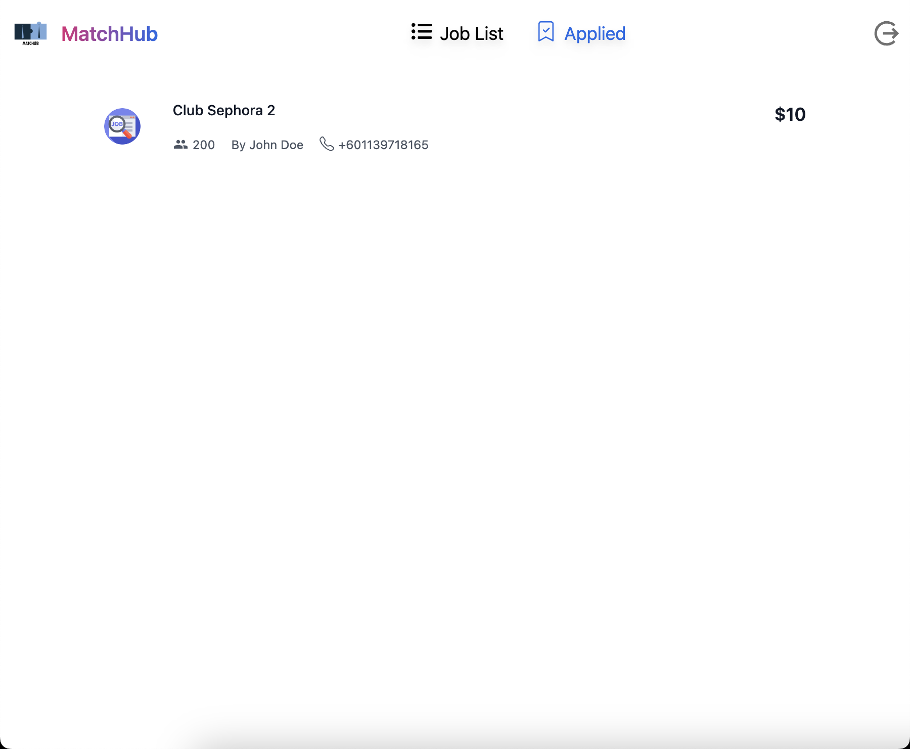

## How to run?

* Install docker.

* Run `docker-compose up` to install and run the application with all its dependencies. 

* Go to `http://localhost:3000/populate` on your browser and click on "Populate DB" to generate the data onto MySQL, and it will show "Done!".
  
  

* Now go to `http://localhost:3000/` as usual to start using the application. 
  
  - This is the login page. You can click on `Sign Up` to go to the sign up page.
    
    
    
    On the sign up page, a user can be created by entering the details. There are both frontend and backend validation. Backend validation is done through the use of passport and JWT. The JWT token will expire after 60s, after which you have to re-login again. This is done for added security.
    
    
  
  - Once the user is authenticated (whether through logging in or signing up), the user is redirected to the home page, which has the list of jobs that the user has not applied to (generated through the `http://localhost:3000/populate` which was done earlier).
    
    
  
  - You can also click on the "Applied" item on the nav bar, which lists the clubs that the particular user has applied to. 
    
    
  
  - Clicking on a certain item from the list on these pages, redirects to the details page, which shows the details regarding the selected club.
    
    
    
    - If the user has not applied to the certain club, the option for "Apply" will be available, and the user can apply to the club.
      
      
    
    - But if the user has already applied to the club, the option for "Apply" will be greyed out and disabled and will instead show "Applied" as the text on the button.
      
      
    
    ## Some important points
    
    * This application uses mySQL as the database since it was one of the core skills on the job requirements. So, I wanted to show my familiarity and adaptability with SQL databases. 
    
    * The current stack that is being used for the company is Next.JS and Nest.JS, so I have also used Next.JS on the frontend and Nest.JS on the backend. Again, to show my proficiency and adaptability.
    
    * I have used Next.JS version 13 since this version will become stable and become the version that will be offered by Next.JS by default in a few months. 
    
    * I have used this application to show that I meet all the requirements that the job requires, and my capability in building full stack applications with ease.        
